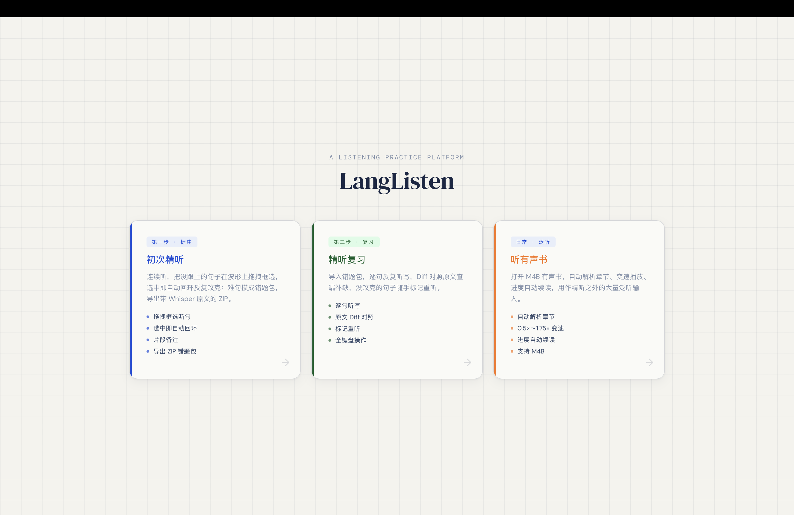
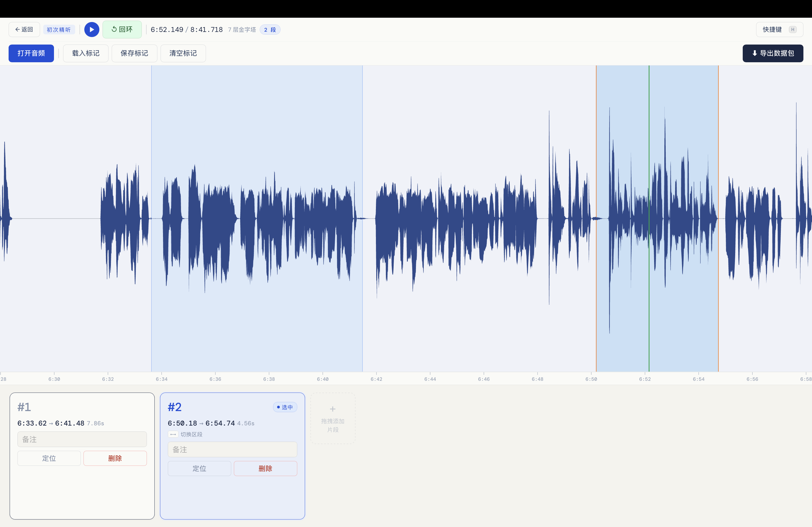
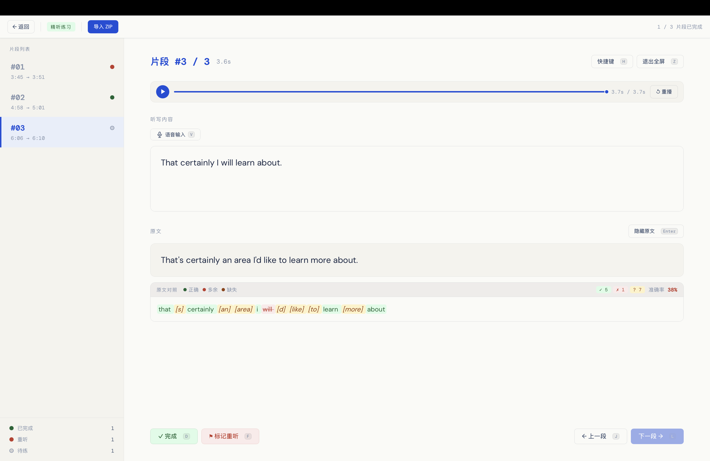
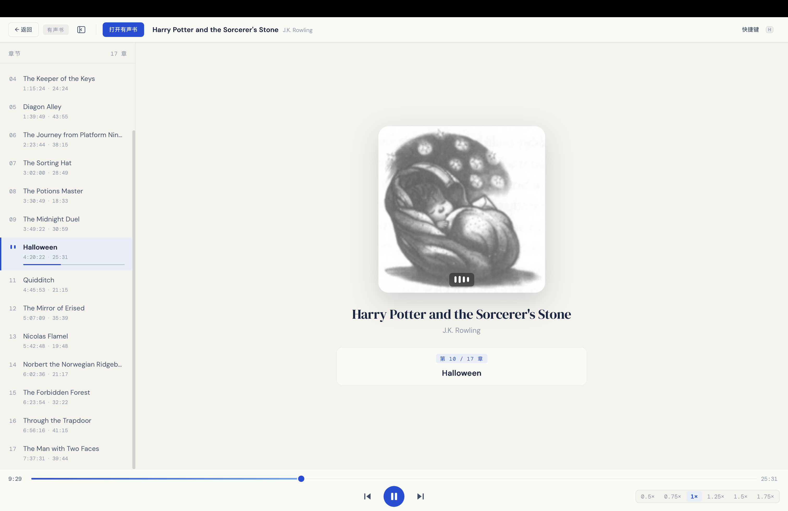

# OwlListen

> 工欲善其事，必先利其器。

**OwlListen 是一款离线的英语精听练习应用。** 听不懂的句子，框出来、反复攻克、查漏补缺——把一次次「跟不上」变成看得见的进步。

基于 Tauri v2 构建，跨平台桌面端，**所有音频处理与转写都在本地完成，不依赖任何云服务。**

<!-- 截图占位：首页三模式卡片
     建议：1020px 宽的首页全景，展示「初次精听 / 精听复习 / 听有声书」三张卡片 -->


---

## 设计理念

- **离线** —— 离线数据、离线练习、离线转写，断网也能用。
- **专注** —— UI 简洁克制，沉浸式，把注意力留给耳朵。
- **成长** —— 重复但不死板，刻意练习每一句难句。

## 核心工作流

OwlListen 把精听拆成「**框选难句 → 攒成错题包 → 逐句复习**」，并配一个**有声书**模式做日常泛听输入。

### ① 初次精听 · 框出听不懂的句子

连续听一段长音频（播客 / 演讲 / 电影对白），哪句没跟上，就在波形上**拖拽框选**——选中即**自动回环**，反复攻克。难句攒成错题包，导出时本地用 Whisper 转写成参照原文，打包为一个 ZIP。

> 边界始终由你的耳朵决定：纯手动框选，程序不做任何自动断句，Whisper 只为你已经标好的片段提供原文参照。

- 波形拖拽框选，选中即自动回环
- 每段可写备注、随手微调边界
- 导出自带 Whisper 原文的 ZIP 错题包

<!-- 截图占位：初次精听界面
     建议：展示波形 + 一个框选高亮的回环片段 + 底部片段卡片列表 -->


### ② 精听复习 · 逐句听写查漏

导入错题包，逐句循环听写，把听到的敲进去，随时与原文做**逐词 Diff 对照**，错漏一目了然。没攻克的句子标记重听，下次再战。整个流程可以全程不离开键盘。

- 逐句循环听写
- 原文 Diff 对照，错漏高亮
- 一键标记完成 / 重听
- 全键盘操作

<!-- 截图占位：精听复习界面
     建议：展示听写输入框 + Diff 对照高亮 + 左侧片段状态列表 -->


### ③ 听有声书 · 日常泛听积累

打开 M4B 有声书，自动解析章节、变速播放、进度自动续读，作为精听之外的大量泛听输入。

- 自动解析内嵌章节
- 0.5×–1.75× 变速不变调
- 进度自动续读，最近书架一键切换
- 流式播放，无需整本预解码

<!-- 截图占位：听有声书界面
     建议：展示章节侧边栏 + 当前进度条 + 封面 -->


---

## 键盘快捷键

| 模式 | 键 | 作用 |
|------|----|----|
| 初次精听 | `空格` | 播放 / 暂停 |
| 初次精听 | `L` | 切换回环 |
| 初次精听 | `← / →` | 上一段 / 下一段 |
| 精听复习 | `P` | 播放 / 暂停（听写时也生效） |
| 精听复习 | `R` | 从头重播 |
| 精听复习 | `Enter` | 切换对照原文 / Diff |
| 精听复习 | `I` / `Esc` | 进入 / 退出输入模式 |
| 精听复习 | `J` / `L` | 上一段 / 下一段 |
| 精听复习 | `D` / `F` | 标记完成 / 重听 |
| 听有声书 | `空格` | 播放 / 暂停 |
| 听有声书 | `J` / `L` | 上一章 / 下一章 |

> 各模式按 `H` 可随时呼出完整快捷键帮助。

## 错题包格式

数据包是自包含的 ZIP，可备份、分享、跨设备同步：

```
listening_pack.zip
├── metadata.json          # 片段时间轴、备注、Whisper 原文
└── segments/
    ├── 0000.mp3           # 16kHz 单声道切片
    └── ...
```

## 技术栈

- **前端** —— React 18 + TypeScript + Vite（无 UI 库，原生样式）
- **桌面壳** —— Tauri v2
- **音频解码 / 切割** —— FFmpeg（`ffmpeg-next`）
- **本地转写** —— Whisper（`whisper-rs`，whisper.cpp 绑定）
- **波形渲染** —— 金字塔峰值索引 + Canvas / WebGL，按采样密度自适应渲染
- **有声书播放** —— `cpal` 直连音频设备 + FFmpeg 流式解码，SPSC 无锁环形缓冲跨线程传样本，变速基于 `atempo`（变速不变调）

## 开发与构建

依赖：Node.js 18+、Rust（stable）、FFmpeg 开发库。

```bash
npm install            # 安装前端依赖
npm run tauri dev      # 开发模式
npm run tauri build    # 生产构建
```

### Whisper 模型

转写需要本地 GGML 模型，放入仓库src-tauri目录的 `whisper-models/`里：

| 模型 | 文件名 | 大小 | 场景 |
|------|--------|------|------|
| base.en | `ggml-base.en.bin` | ~140 MB | 速度优先 |
| small.en | `ggml-small.en.bin` | ~470 MB | 默认，平衡 |
| medium.en | `ggml-medium.en.bin` | ~1.5 GB | 质量优先 |

模型可从 [whisper.cpp](https://huggingface.co/ggerganov/whisper.cpp/tree/main) 下载。当前默认 `small.en`。
