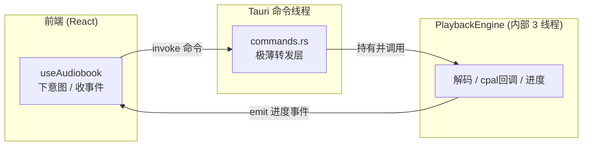
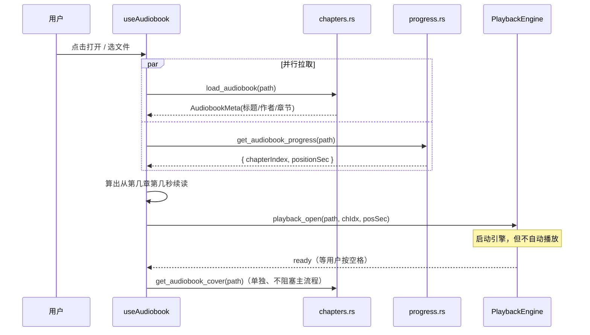
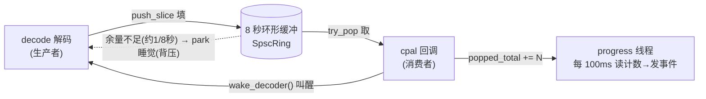
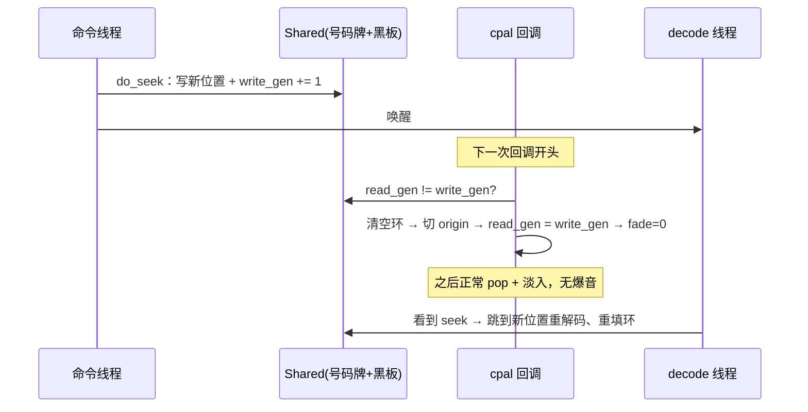
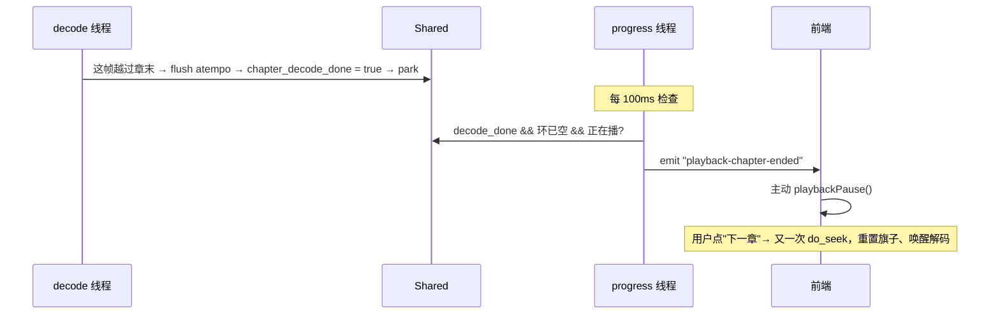
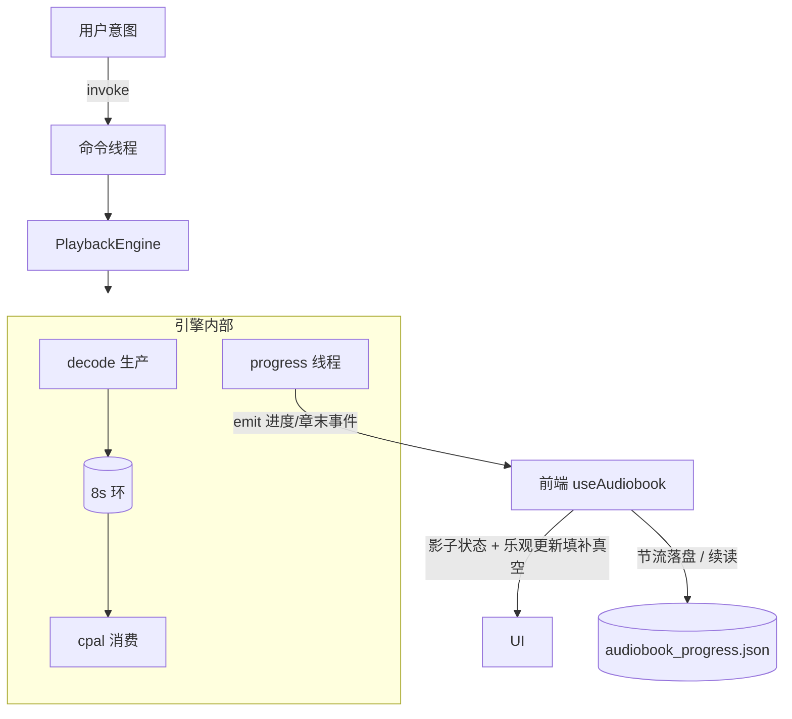

# 有声书模块架构

> 本文从**设计层面**讲清 OwlListen 有声书功能的工作原理，方便回顾。
> 阅读顺序：先建立心智模型（三个世界 / 三线程），再看生命周期，最后看四个难题与前端协作。
>
> ⚠️ **维护约定**：当有声书的架构发生改动（线程模型、缓冲/seek 机制、变速、进度换算、前后端事件契约等），请同步更新本文，避免文档与代码漂移。

涉及文件：

| 层 | 文件 |
|----|------|
| 前端 hook | `src/hooks/useAudiobook.ts` |
| 前端页面/组件 | `src/components/audiobook/*` |
| 前端 API 封装 | `src/utils/audiobookApi.ts` |
| Tauri 命令（转发层） | `src-tauri/src/commands.rs`（`playback_*` / `*_audiobook*`） |
| 章节解析 | `src-tauri/src/audiobook/chapters.rs` |
| 播放引擎 | `src-tauri/src/audiobook/playback.rs` |
| 进度/书架持久化 | `src-tauri/src/audiobook/progress.rs` |

---

## 0. 心智模型：三个并发的"世界"

整个系统活在三个并发世界里，理解它们的**职责边界**是理解全部代码的钥匙。



**关键认知**：前端**从不直接碰音频**。它只做两件事——通过 `invoke` 下命令（打开 / 播放 / seek / 变速），通过 `listen` 收后端推来的进度事件。真正的音频在 Rust 引擎里，引擎实例存在 `AppState.playback: Mutex<Option<PlaybackEngine>>`，命令线程只是把调用转给它（每个命令约 3 行，见 `commands.rs:794-832`）。

引擎内部又有**三个 Rust 线程**，这是全部复杂度的来源：

| 线程 | 角色 | 节奏 | 铁律 |
|------|------|------|------|
| **cpal 回调** | 消费者：从缓冲取样本喂硬件 | 音频驱动实时回调（几 ms 一次） | **绝不能阻塞**，否则爆音 |
| **decode 解码** | 生产者：FFmpeg 解码 + atempo 变速，填缓冲 | 尽量填满就睡 | — |
| **progress 进度** | 旁观者：算位置、发事件 | 每 100ms | — |

它们之间靠一个 `Arc<Shared>`（`playback.rs:148`）通信，中间隔着一个 **8 秒的无锁环形缓冲**。所有难点都来自同一个矛盾：

> **用户随时会 seek / 变速 / 换章，而 cpal 回调在另一个时间维度上实时狂跑，两者要无锁、无爆音地协调。**

🍳 **餐厅类比**（全文沿用）：
- **解码线程 = 后厨厨师**：一阵猛做菜，冰箱（缓冲）满了就歇着。
- **cpal 回调 = 传菜员**：卡着严格钟点不停上菜，不能停下干别的。
- **进度线程 = 经理**：每隔一会儿瞄一眼出菜口，给顾客发消息"上到第 3 道了"。不做菜、不传菜，只汇报。

### 为什么是 3 线程而不是 2？

"生产者 + 消费者"是最核心的 2 个。第 3 个进度线程被一条铁律逼出来：**cpal 回调绝对不能做重活或阻塞**。而"算秒数 + JSON 序列化 + 跨进程发事件"恰恰是重活，塞进 cpal 回调会爆音。也不能交给解码线程——它节奏不规律（背压时睡、换章时睡很久），但 UI 需要**稳定的 100ms 心跳**。所以独立出一个"节拍器"线程，只读共享计数器、稳定汇报。

---

## 1. 生命周期：打开一本书

用户点「打开有声书」→ `AudiobookScreen.handleOpenBook` → `openBookWithCover` → hook 的 `openBook`（`useAudiobook.ts:101`）。



**章节从哪来**（`chapters.rs:parse_audiobook`）：
- `ffmpeg::format::input` 打开文件，`metadata()` 取 title / artist（作者做了 `artist → album_artist → author` 兜底链）。
- `input.chapters()` 读 M4B 内嵌章节。每章 `start()/end()` 是以该章 `time_base` 为单位的整数，需 `× (numerator/denominator)` 换算成秒——容器格式时间戳的通用套路："**时间戳 × time_base = 秒**"。
- **没有章节的书**兜底造一个覆盖全书的单章，保证下游永远至少有一章。

**封面**走单独命令（`commands.rs:extract_cover`）：优先找带 `ATTACHED_PIC` 标志的流，读第一个 packet，靠文件头**魔数**判断 jpeg（`FF D8 FF`）/ png（`89 50 4E 47`），base64 返回，前端用 `data:` URL 显示。

---

## 2. 引擎启动：`PlaybackEngine::open`（playback.rs:207）

从"静态元数据"跨进"实时音频"的门：

1. **探测源采样率** `probe_audio_rate`。
2. **核心架构决策**：cpal 输出流**直接配置成源采样率**（如 22.05kHz），应用内**完全不做重采样**；硬件采样率（如 48kHz）的差异交给操作系统音频层（CoreAudio / WASAPI）。
   > 这是 commit 历史里「去掉会崩的重采样」「按源采样率播放」的落地——少一条易错且会崩的管线，音高/语速还绝对正确。
3. **建 `Shared`**：环形缓冲容量 = `源采样率 × 8 秒` + 一组原子量。
4. **`build_stream` 建 cpal 回调**，建完先 `pause()`。
5. **spawn 两个线程**：`decode_loop` 与 `progress_loop`（cpal 回调线程由 cpal 内部管理，不在这里 spawn）。

此刻状态：**三线程都活着，但 cpal 是 paused，环是空的，没有声音。**

---

## 3. 心脏：SpscRing 与生产-消费-背压

### 3a. 无锁环形缓冲 SpscRing（playback.rs:76）

单生产者（decode）、单消费者（cpal）的 lock-free 队列，存 `f32` 样本：

- `head`（写入位置）、`tail`（读取位置）都是**单调递增的 u64**，落点用 `% capacity` 取模。用单调递增而非回绕指针，好处是 `clear()` 只需 `tail = head`，消费端**瞬间看到空**，无"缓存视图不一致"问题。
- 内存序是标准 SPSC 协议：生产者写完数据 `head.store(Release)`，消费者 `head.load(Acquire)`——这对 Release/Acquire 保证"消费者看到新 head 时，对应样本数据一定已写入"。这是无锁正确性的命根子。

### 3b. 三线程的"生产-消费-背压"舞蹈



**一个稳态循环**（正在播、1 倍速、用户没动）：

1. **cpal 回调被驱动触发**："给我 N 个样本。" 从环 `try_pop` 出 N 个，单声道复制到所有声道，写进输出 buffer。然后 `popped_total += N`（记账）+ `wake_decoder()`（戳醒厨师）。**整个回调只做这些，绝不阻塞。**
2. **解码线程被叫醒**：检查"有没有人动过"（seek？变速？章末？满了？），稳态下都没有，于是解码一帧 → 过 atempo → push 进环；**循环填，直到环快满 → 去睡。**
3. **进度线程**：与上面无关，自顾自每 100ms 读 `popped_total`、算秒数、发事件。

**精髓**：生产者和消费者**不直接等对方**，只通过环的 head/tail + 一个唤醒信号沟通。厨师可提前备好 8 秒的菜，传菜员稳稳一道道上，节奏完全解耦。

### 背压（back-pressure）是什么

> **下游处理不过来 / 缓冲满了时，反向"顶住"上游，逼它慢下来或暂停，而不是无脑生产。**

💧 倒水类比：杯子快满就停手，等别人喝掉再倒。这里 decode 发现 `ring.vacant() < capacity/64`（约 1/8 秒余量，`playback.rs:664`）就 `park_decoder` 睡觉，等 cpal 取走样本腾出空间再被唤醒。`park_decoder`（`playback.rs:957`）用 `Condvar` + 200ms 超时兜底。

**为什么缓冲是 8 秒**：够大能扛住解码卡顿/调度抖动，保证**永不断流**；又不能太大，否则 seek 清空重填延迟高、占内存。8 秒是甜点。

### underrun 保护

万一环空了（生产跟不上），cpal 不输出垃圾，而是把上一样本 `× 0.95` 衰减到静音（`playback.rs:498-506`），避免爆音——实时音频的标准防御。

### 一个漂亮的副作用

开书时 cpal 是暂停的（不取），但解码线程**不看"在不在播"，照样先把 8 秒缓冲填满**。所以一按空格，缓冲里已有满满 8 秒音频，**声音瞬间就出来**。
> ⚠️ 反直觉点：**暂停 ≠ 解码停**。暂停只是 cpal 不取 → 解码很快填满 → 解码自己因背压去睡。一按播放立刻复活。

---

## 4. 四个难题与解法

四个难题本质是同一个问题：**用户在某时刻"插了一脚"，而此刻环里还存着 8 秒"旧位置"的音频，cpal 正实时往外播——怎么让切换瞬间、无缝、不爆音？**

它们共享同一个底层开关：**`do_seek`（改号码牌 + 写黑板）**——seek、变速、换章全靠它。

### 难题① 🎯 seek 不爆音：两个"代号"的握手

不让两个线程"同时动手"，而是用一对计数器传话，让**清空环的动作只发生在 cpal 自己手里**（杜绝数据竞争）。

- `write_gen`（写代号）：命令线程每发起一次 seek 就 **+1**，并在"小黑板"写好新位置 / 新章节。
- `read_gen`（读代号）：cpal 每次回调**先瞄一眼**。发现"牌号变了！"→ **由它自己**清空环、读黑板切到新位置、把 `read_gen` 对齐成新号、音量从 0 淡入。



🔑 无锁并发常用招法：**不共享"动作"，只共享"意图标记"，让各线程在自己安全的时机响应标记。** 淡入保证切换瞬间不爆音。

### 难题② 🎚️ 变速不变调：atempo 滤镜

0.75 倍速要变慢但**音调不变**。用 FFmpeg 内置 `atempo` 滤镜（phase-vocoder，频域上拉伸时间保持音高）。`AtempoFilter`（`playback.rs:769`）把它包成接在解码后的小流水线：

```
解码出的 PCM → [atempo=0.75 变速] → [降混成单声道] → 推进环
```

**关键约束**：atempo 速率**建滤镜时定死，中途改不了**。所以用户每次切档，都必须**推倒重建整条滤镜**（`playback.rs:628-635`）——这牵连到难题③。
> 这条流水线还顺手**多声道降混成单声道**（人声朗读单声道足够，省一半数据，也让 cpal 那段"单声道复制到 N 声道"成立）。

### 难题③ 📐 变速下的进度换算：为什么变速要"原地 seek"

进度线程靠"cpal 取走了多少样本（`popped_total`）"反推秒数。但变速会破坏换算：0.5 倍速下 atempo 把 1 秒源音频拉成 2 秒输出样本。所以：

```
源音频前进秒数 = 取走的输出秒数 × 速率      （playback.rs:1032）
```

**真正的坑**：用户**播到一半切速率**。切前那段按旧速率累计 `popped`，切后按新速率——用同一个总数会在切换点**算错、进度跳变**。

**解法很巧**：每次变速，**假装在当前位置做一次 seek**（`set_speed` 内部触发 `do_seek`，`playback.rs:370`）。这一下：① 把进度基准 origin 快照到当前秒、计数归零重算；② 顺便触发难题①的清环 + 难题②的重建滤镜。于是"切速率"被统一成"在当前位置用新速率重新开始"，换算永远只在单一速率段内做。**一个动作同时解决三件事**，是这段代码最优雅处。

### 难题④ 🏁 章节边界：让播放停在章末

解码是连续的，FFmpeg 不知道"章"。解决：解码线程一边解码一边盯时间戳，**一旦这帧越过"当前章末"**（`playback.rs:688`）：
1. 把 atempo 内部残留 flush 出来（否则尾巴丢半帧）；
2. 竖旗子 `chapter_decode_done = true`；
3. 解码线程去睡（不越界解下一章）。



> 必须在"还没把这帧推进环"之前就停，否则会越界播进下一章、进度跳章、用户点下一章还会多跳一章。音频里"差一帧"是常见 bug 源。

---

## 5. 前端：影子状态与乐观更新

### 5.0 核心哲学

> **前端不被动等后端，而是自己维护一份"影子进度"，大胆先更新 UI，再让后端事件流来"对账"。**

原因：后端有个**信息真空期**——见 5.2。

### 5.1 正常情况：两条事件流（`useAudiobook.ts:65 / :90`）

- **`playback-progress`**（每 100ms）：带 `chapterIndex / positionSec / playing`，前端收到刷新 UI。稳态下进度条丝滑前进全靠它。
- **`playback-chapter-ended`**（章末一次）：前端收到后**主动调 `playbackPause()`** 让后端停下，避免 cpal 空转。

### 5.2 信息真空：为什么前端要"先斩后奏"（乐观更新）

`goToChapter / nextChapter / prevChapter` 都**先改前端 state，再调后端 seek**。为什么不等事件？因为**那个事件可能永远不来**：

- seek 会让后端 `write_gen += 1`，而 `read_gen` 只在 **cpal 回调真正跑时**才追上。
- 若此刻是**暂停**状态点章节——cpal 停着、回调不跑、`read_gen` 永远追不上 → 进度线程一直卡在 `playback.rs:1022` 的 `continue`，**一个事件都不发**。

所以前端必须乐观更新，UI 立刻跳，等播放恢复后用后端真相对账覆盖。
🔑 普遍模式：**高延迟/可能无响应的操作，前端先乐观反映意图，用后续权威数据流做最终一致。**

### 5.3 为什么到处是 `xxxRef` 又有 `xxxState`

- **state** 给**渲染**用（一变就重渲染，进度条才动）。
- **ref** 给**稳定回调**用（存最新值但不触发渲染）。

两个 `listen` 的 `useEffect` 依赖是 `[]`（只注册一次），其回调若直接读 state 会拿到注册那刻的旧值（闭包陷阱）。读 `bookPathRef.current` 才是最新（`useAudiobook.ts:79`）。
🔑 口诀：**要让画面变 → state；要在"只创建一次的回调"里读最新值 → ref。**

### 5.4 进度保存：高频节流 + 状态切换强存

不能每 100ms 写盘。两条腿：
1. **节流保存**（`useAudiobook.ts:76`）：progress 事件里，只有"正在播 且 距上次超 5 秒（`SAVE_INTERVAL_MS`）"才落盘。
2. **暂停时强制保存**（`:150`）：一暂停事件流就停，必须在离开播放态瞬间补一刀。

🔑 套路：**高频流上节流，关键状态转移点上强制刷新。**

### 5.5 持久化与最近书架（`progress.rs`）

存储极简——**一个 JSON 文件** `audiobook_progress.json`（app 数据目录）：

```json
{
  "progress":     { "/path/book.m4b": { "chapterIndex": 3, "positionSec": 124.5 } },
  "recentBooks":  [ { "path", "title", "author", "lastOpened" } ]
}
```

- **进度**是 `路径 → {章节, 秒数}` 字典，读写都是"读整个文件 → 改一处 → 写回"（数据量小，无需数据库）。
- **最近书架**是 MRU 列表：`push_recent_book` 先按路径去重 → 插队头 → 截断到最多 10 本。
- **"自动续读"** = 这个 JSON + 开书时 `openBook` 并行读一下进度。

### 5.6 三个值得学的 UX 细节

1. **延迟 200ms 显示加载弹窗**（`AudiobookScreen.tsx:124`）：缓存命中秒开时不闪弹窗；超过 200ms 才显示，提前加载完就 `clearTimeout`。
2. **乐观删除 + 失败回滚**（`:66`）：删最近书立刻从本地 `localRecent` 移除（秒响应），后端失败再加回去并排序。与 seek（几乎不失败、不回滚）对比——**是否回滚取决于失败概率与后果**。
   > Screen 维护本地镜像 `localRecent`，用 effect 从 hook 同步；删到 0 也要覆盖，**别加 `length > 0` 守卫**。
3. **seek 后重新 apply 速率**（`:170`）：防御性——后端 seek 重建管道理论上保留速率，前端仍幂等重申一次（`set_speed` 发现没变会直接返回）。

---

## 6. 全局串联



整个系统的设计内核两句话：

1. **后端**：用一个 8 秒缓冲解耦"实时播放"与"按需解码"，再用一套 `write_gen/read_gen` 握手让用户的随机操作能无锁、无爆音地插进来；`do_seek` 是 seek / 变速 / 换章共用的万能开关。
2. **前端**：不盲信后端事件流（它有真空期），自己维护影子状态、乐观先行，用后续事件做最终对账。
